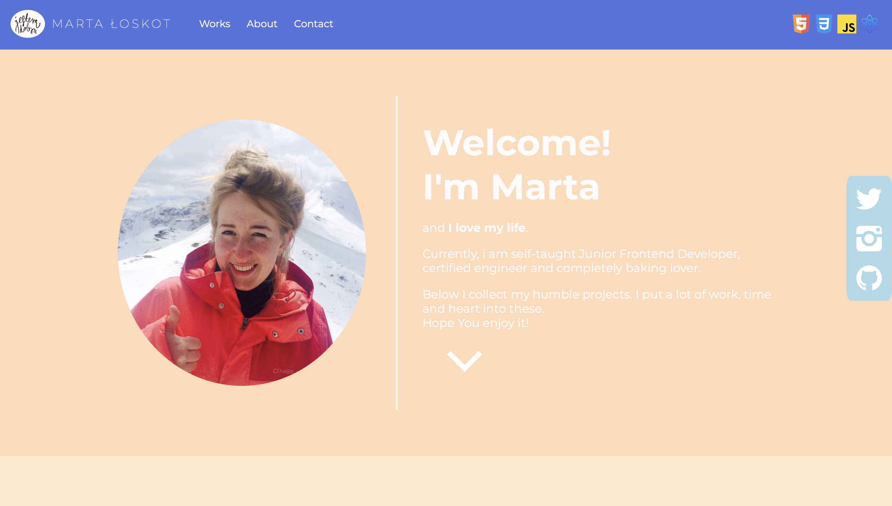

#   🎊 My Portfolio! 🎊

## 💙 What's it about?

In progress :) The bigest project I've made so far, with @media and @keyframes. Love it!

## 💙 First look 

## 💙 Technologies

+ HTML 5
+ CSS 3
+ JavaScript

## 💙 Inspiration
This portfolio is part of an amazing Full Stack Developer Course created by  ♥ Ania Kubow ♥. Love this women, her sense of humor and ability to explain hard, code-things in a way that I finally understand. 🏆
You can check this course [here](https://www.codewithania.com/about) and I absolutely encourage You to visit her [YouTube](https://www.youtube.com/@AniaKubow) channel 💕.
